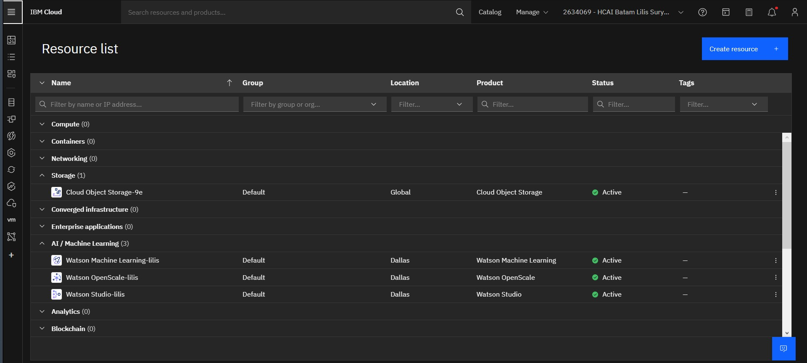
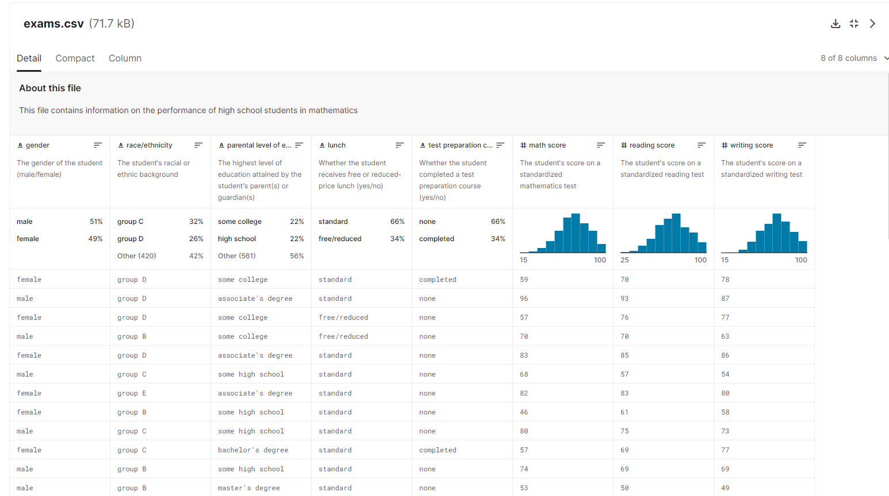
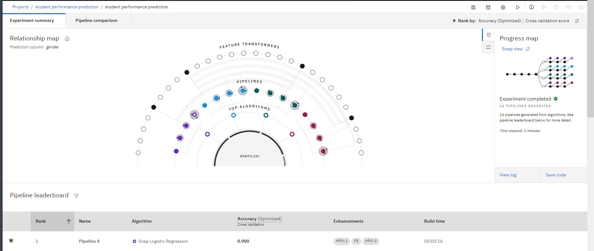
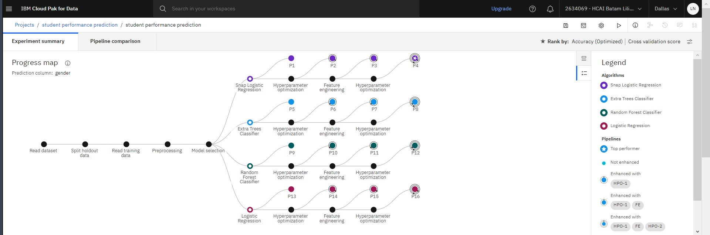
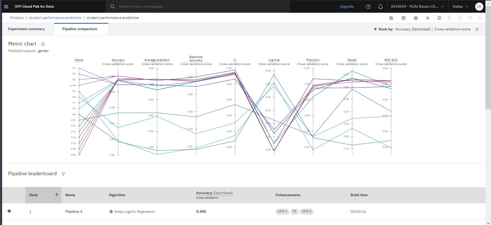
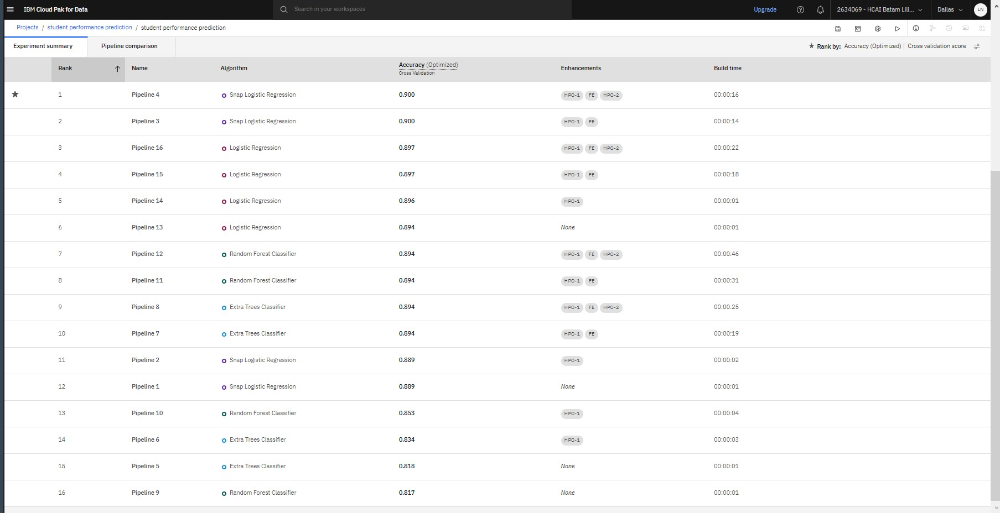
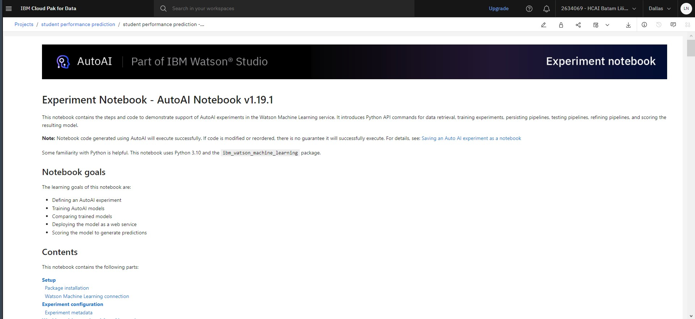
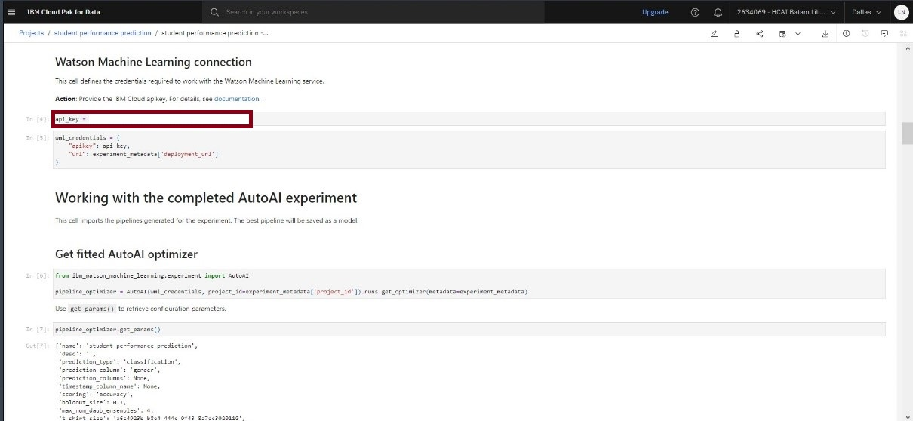
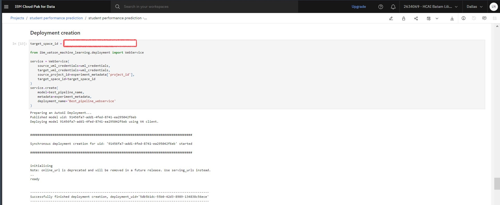

##### README.md

## Student Performance Prediction for Pipeline Models using AutoAI

### Summary

In this code pattern, we will learn how to automatically generate a Jupyter notebook that will contain Python code of a machine learning model using AutoAI. We will explore, modify and retrain this model pipeline using python code. Lastly, we will deploy this model in Watson Machine Learning using WML APIs.

### Description

AutoAI is a graphical tool available within Watson Studio that analyzes your dataset, generates several model pipelines and ranks them based on the metric chosen for the problem. This code pattern shows extended features of AutoAI. More basic AutoAI exploration for the same dataset is covered in the Generate machine learning model pipelines to choose the best model for your problem article.

When you have completed this code pattern, you will understand how to:

- Run an AutoAI experiment.
- Generate and save a Python notebook.
- Execute notebook and analyse results.
- Make changes and retrain model using Watson Machine Learning SDKs.
- Deploy model using Watson Machine Learning from within notebook .

### Architecture Components

### Flow

1. The user submits an AutoAI experiment using default settings.
2. Multiple pipeline models are generated. A pipeline model of choice from the leaderboard is saved as Jupyter notebook.
3. The Jupyter notebook is executed and a modified pipeline model is generated within the notebook.
4. Pipeline model is deployed in Watson Machine Learning using WML APIs.

### Included Components

- IBM Watson Studio - IBM Watson® Studio helps data scientists and analysts prepare data and build models at scale across any cloud.
- IBM Watson Machine Learning - IBM Watson® Machine Learning helps data scientists and developers accelerate AI and machine-learning deployment.

### Feature Technologies

1. Machine Learning - Science of predicting values by analysing historic data.
2. Python - Python is an interpreted, object-oriented, high-level programming language.
3. Jupyter notebook - Open-source web application to help build live code.
4. scikit-learn - Python based machine learning library.
5. lale - Python library compatible with scikit-learn for semi-automated data science used in AutoAI SDK

### Prerequisites

- IBM Cloud account This code pattern assumes you have an IBM Cloud account. Sign up for a no-charge trial account - no credit card required.
  > Instructions to get through the list of prerequistes are covered in this prequel.
- Create a Cloud Object Storage service instance.
- Create a Watson Studio service instance.
- Create a Watson Machine Learning service instance.
- Create a Watson Studio project and load data.

### Dataset

### Experiment Summary

##### Relationship Map

##### Progress Map

Experiment summary bisa dilihat menggunakan mode Relationship map dan Progress map untuk melihat pipeline yang paling baik (top performance) akurasinya dari alghorithm yang digunakan yaitu: Snap Logistic Regression, Extra Trees Classifier, Random Forest Classifier, Logistic Regression.

## Pipeline Comparison

untuk melihat perbandingan pipeline bisa melihatnya di pipeline comparison dari pipeline 1-16. Maka kita bisa melihat perbandingan pipeline 4 adalah yang paling tinggi accuracynya yaitu 0.900

## Experiment Notebook

Notebook ini berisi langkah-langkah dan kode untuk mendemonstrasikan dukungan eksperimen AutoAI di layanan Watson Machine Learning. Ini memperkenalkan perintah API Python untuk pengambilan data, training experiments, persisting pipelines, testing pipelines, refining pipelines, dan penilaian model yang dihasilkan. Secara singkatnya Experiment notebook ini fungsinya untuk mencari cara supaya bisa prediksi sesuai yang diinginkan.

## Setup Api keys

Untuk mendapatkan api_key yaitu dengan cara:

1. Buka dashboard lalu pilih Manage kemudian pilih Access (IAM)
2. Kemudian pilih navigasi API keys, lalu pilih create
3. Masukkan nama project lalu create
4. Lalu copy API key tersebut ke experiment notebook.

## Setup Deployments Creation

untuk mendapatkan target_space_id yaitu dengan cara:

1. pertama pilih deployments pada dashboard
2. Jika sudah masuk ke navigasi deployments maka pilih project yang akan di deploy.
3. kemudian masuk ke menu manage lalu pada space GUID copy kodenya untuk di masukkan ke experiment notebook (target_space_id)
